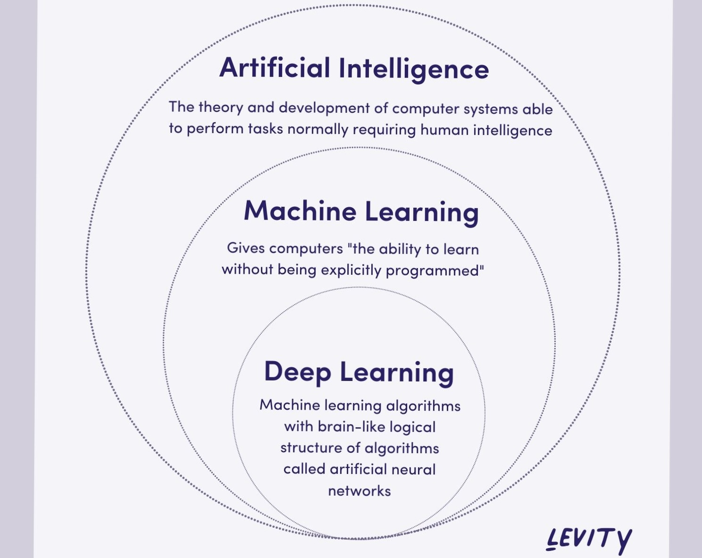
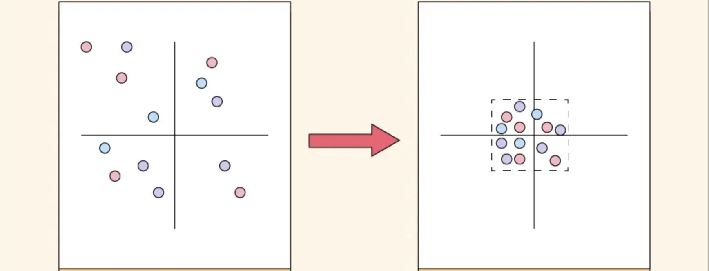
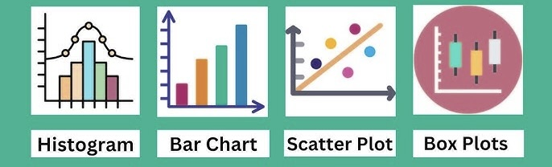

# Machine Learning Level 1

## Index

1. [What is Machine Learning?](#1-what-is-machine-learning)
2. [Introduction & Learning Objectives](#2-introduction-and-learning-objectives)
3. [Humanism and AI ethics](#3-humanism-and-ai-ethics)
4. [Data](#4-data)
    - CSV  
    - Importing Data  
    - Cleaning  
    - Statistics  
    - Graphs  
5. [Data Transformation](#5-data-transformation)
    - Scaling  
    - Encoding  
    - Feature Engineering  
6. [Types of Graphs](#6-types-of-graphs)
7. [Data Analysis](#7-data-analysispreprocessing)
8. [Data Storytelling](#8-data-storytelling)


## 1) What is Machine Learning

<kbd></kbd>

### What?
Machine learning is a branch of artificial intelligence focused on developing algorithms that allow computers to **learn from data and improve their performance over time without being explicitly programmed for every task.**

### How?
Models are trained on historical data (input) to identify patterns and relationships. Once a model is trained, they can make predictions or decisions when new data is introduced.

### Why?
It automates decision-making processes and continuously improves performance, often handling complex tasks and large datasets more efficiently than traditional programming approaches.

---

#### Example: Email Spam Filtering

<kbd></kbd>

When you use Gmail, Google automatically filters spam emails into a separate section or displays a warning at the top of the email. This occurs because Google has developed a spam filter that automatically sorts unwanted emails.
- **Data Collection:** Gather a large dataset of emails labeled as "spam" or "not spam."
- **Feature Extraction:** Extract features from these emails that might help identify spam, such as specific words, sender's address, presence of links, etc.
- **Algorithm Training:** Create an algorithm that learns the characteristics of spam emails from the labeled dataset.
- **Prediction:** When a new email arrives, the trained model analyzes it and predicts whether it's spam.
- **Adaptation:** Then, as users encounter new, different, or evolving types of spam, they can provide updated data, and the algorithm will adapt by retraining with the new information, ensuring it remains effective over time.


*This is just a simple example of what machine learning can be used for. In the medical field, for instance, a model trained on a large number of MRI scans might be able to distinguish and predict whether a patient has cancer. Similarly, in business, a model could analyze data from a specific stock to forecast whether its price will go up or down. The possibilities for Machine Learning use are endless.*

## 2) Introduction and Learning Objectives

- Discuss humanism and AI ethics in machine learning.
- Understand basic concepts of data analysis and statistics.
- Learn how to handle and clean data in CSV format using Python.
- Become familiar with basic types of visualizations and data storytelling.

## 3) Humanism and AI ethics

Artificial Intelligence and Machine Learning have evolved rapidly in recent years and are becoming increasingly integrated into daily life. Models like ChatGPT or DALL-E generate text, images, and music with impressive creativity and accuracy. Autonomous systems, such as robotic assistants and self-driving cars, demonstrate AI’s ability to operate in real-world environments with minimal human intervention.

**Major Concerns:**
- **Job Displacement:** Automation may replace human workers in sectors like manufacturing, customer service, and creative fields.
- **Privacy:** The use of large amounts of personal data raises important questions about data collection and sharing.
- **Authenticity:** With AI capable of generating realistic text, images, and videos, distinguishing between real and artificial content becomes challenging.

Ethical considerations in AI are becoming more and more urgent. Balancing innovation with accountability, transparency, and fairness is crucial to ensure AI serves the public good rather than increasing societal inequalities. 

This is a broad topic and very physiological, and there are many online resources to learn more about humanism and ethics. The main point is to recognize these values and concerns when pursuing AI.

## 4) Data

Since there is no Machine Learning without data, it is crucial to understand how data is collected, processed, and used effectively in ML models. 

Data is the foundation of Machine Learning because models learn patterns and make predictions from the information provided so it's very important we handle data correctly.

#### CSV Files

There are three main types of data:
- **Structured Data:** Organized into tables with clear relationships 
    - (CSV files, databases, spreadsheets)
- **Unstructured Data:** Includes text, images, videos, and audio files; often requires advanced analysis techniques like Natural Language Processing (NLP) or Computer Vision.
- **Semi-structured Data:** Falls between structured and unstructured 
    - (JSON or XML).

In this presentation and in most models, we will be working with CSV Files which are the most common format of data.

CSV files stand for Comma-separated values, it popular because it's easily readable by programs and people, it has rows and columns that are separated by commas


#### Importing Data with Google Colab

We will be using Google Colab (cloud-based Jupyter Notebook) to demonstrate all the code. Google Colab is specifically designed for machine learning, so no need to install certain libraries. It also offers free cloud GPUs and CPUs to run models. So anyone can experiment without needing a powerful laptop

There are many ways to import data, and the process varies depending on the source and format. Each website or platform will have specific instructions for downloading or accessing data, but the main goal is to load the dataset into a Pandas DataFrame (df). This allows us to clean, analyze, and manipulate the data efficiently.

**DataFrame Components:**

We want our data in a DataFrame so we can eventually access:

- **X (features):** The independent variables used for predictions.
- **Y (target variable):** The dependent variable we want to predict.

**Popular Dataset Sources:**
- Kaggle
- Openml
- Google Dataset Search
- UCI Machine Learning Repository

For these examples, we will use the Iris Dataset from Scikit-learn. Note that Scikit-learn typically loads datasets as Bunch objects rather than CSV files; to maintain consistency, we will work with a CSV version that has been modified to include missing values, duplicates, and outliers.

Download this file and place it in a organized folder in Google Drive

[Iris DataSet](dataset/Iris.csv)

##### Example: Importing Data from Google Drive in Colab

```python
from google.colab import drive
drive.mount('/content/drive')

import pandas as pd

# Replace 'path_to_file.csv' with your actual file path
df = pd.read_csv('/content/drive/MyDrive/path_to_file.csv')
```

### Data Cleaning

Now that we have read over our Data and have it in our software, we can observe some things about the dataset

With Real-world datasets, most are never perfect, they will usually have missing values, outliers and mistakes when imputed during the data collection process. 

Data cleaning is the process of fixing or removing incorrect, corrupted, or incomplete data from our dataset. This step is essential because bad data leads to bad results

So before we create any machine learning models we need to make sure our data is readable.


#### Common Data Cleaning Steps:
- **Remove Duplicates:** Eliminate duplicate rows.
- **Remove Outliers:** 
    - Remove data points that are significantly higher or lower than the rest of the data.
    - Important because some values may be too high or too low compared to the rest of the data and will misrepresent the data as a whole
    -  What if our data set is really big, we cant look through all the values manually? 
        -  In the next presentation, I will show advanced techniques to remove unwanted values

- **Handle Missing Data:** Identify rows with missing (NaN) or zero values, and either remove or fill them.

##### Example: Data Cleaning Code in Colab

```python
# Remove duplicate rows
df = df.drop_duplicates()

# Remove rows with missing values
df = df.dropna()

# Alternatively, fill missing values (e.g., using the column mean)
# df.fillna(df.mean(), inplace=True)
```

### Statistics in Data Cleaning

Statistics help us understand the structure and quality of data before using it in machine learning models

By applying statistical methods, we can detect errors, identify missing values, handle outliers, and ensure data consistency.


| **Statistic**            | **Meaning**                                     | **Example Usage**                                 |
|--------------------------|-------------------------------------------------|---------------------------------------------------|
| **Mean**                 | Average value of a column                       | Fill missing values for normally distributed data |
| **Median**               | Middle value (less affected by outliers)        | Fill missing values for skewed data               |
| **Mode**                 | Most common value in a column                   | Fill missing values for categorical data          |
| **Standard Deviation**   | Measure of data spread from the mean            | Identify highly dispersed data                    |
| **Min/Max**              | Smallest and largest values                     | Spot potential errors in data                     |
| **Percentiles (25%, 75%)**| Distribution spread                             | Detect outliers                                   |


### Common pandas Functions for Machine Learning

#### Data Import and Inspection

- **`pd.read_csv("file.csv")`**: Reads a CSV file into a DataFrame.

- **`df.head()`**: Shows the first few rows of the DataFrame.

- **`df.tail()`**: Shows the last few rows of the DataFrame.

- **`df.info()`**: Gives an overview of data types and non-null counts.

- **`df.describe()`**: Returns descriptive statistics for numeric columns.


#### Handling Missing Values

- **`df.isnull().sum()`**: Shows the total count of missing values per column.

- **`df.dropna()`**: Drops rows (or columns) with missing values.

- **`df.fillna(value)`**: Fills missing values with a given value or method (`method='ffill'`).


#### Data Cleaning & Transformation

- **`df.drop_duplicates()`**: Removes duplicate rows.

- **`df.rename(columns={"old_name": "new_name"})`**: Renames columns.

- **`df['col'].astype(new_dtype)`**: Converts a column to a specified data type.

- **`df['col'].apply(function)`**: Applies a custom function to each element in a column.

- **`df.loc[row_indexer, col_indexer]`**: Selects data by label.

- **`df.iloc[row_indexer, col_indexer]`**: Selects data by integer position.


#### Feature Engineering

- **`df['new_col'] = df['col1'] + df['col2']`**: Creates a new feature by combining existing columns.

- **`pd.get_dummies(df['categorical_col'])`**: Applies one-hot encoding to a categorical variable.

- **`df['col'].map(mapping_dict)`**: Replaces the values of a column using a dictionary map.

#### Exploratory Data Analysis (EDA)

- **`df['col'].value_counts()`**: Counts occurrences of each category in a column.

- **`df.corr()`**: Computes pairwise correlation between columns.

- **`df.describe(include='all')`**: Gives descriptive stats for numeric and object columns.


#### Machine Learning

- **`X = df.drop('target', axis=1)`**: Splits features from the target column.

- **`y = df['target']`**: Sets the target column separately.

- **`train_test_split(X, y, test_size=0.2, random_state=42)`**: Splits data into training and testing sets (from scikit-learn).


## 5) Data Transformation

Data transformation converts raw data into a format that is more suitable for machine learning models. The main processes include:

### Scaling

Scaling is crucial for algorithms that rely on distance or gradient-based methods. When features are on different scales, some may dominate others. Common techniques include:

For example, consider two features:
- ***Hours***: Values range from [0.0 - 24.0].
- ***Meters***: Values range from [500 - 1000].

In this scenario, both features are equally important, but the ***meters*** feature has a much larger scale compared to the ***hours*** feature. This means that when calculating distances (or gradients), the ***meters*** feature will have a disproportionately large impact on the result. Which might result in the model giving more importance to the meters feature and end up having skewed predictions.


- **Standardization (Z-score Scaling):**  
  - Use when data is normally distributed or for linear models/neural networks.
  - Transforms data so that each feature has a mean of 0 and a standard deviation of 1.
  
- **Min-Max Normalization:**  
  - Scales data to a fixed range, typically 0 to 1.
  - Useful for algorithms that rely on distance metrics.
  
- **Robust Scaling:**  
  - Uses the median and interquartile range, making it less sensitive to outliers.

<kbd></kbd>


### Encoding Categorical Variables

Machine learning algorithms cannot handle categorical data directly, models require numerical input, so categorical data (ex: "Red", "Green", "Blue") must be encoded into numbers.

Here are 2 common methods:

- **Label Encoding:**  
    - Converts each unique category into an integer.  
        - *Example:* {"Red": 0, "Green": 1, "Blue": 2}  
    - Useful when there is some ordering or ranking to the categories
    - *Note:* This may imply an order between categories (ex: 0 < 1 < 2), which may not always be meaningful.
  
- **One-Hot Encoding:**  

    - Creates new binary columns (dummy variables) for each category. 
    - Keeps data in a form that many ML algorithms handle well (especially tree-based models).
    - *Note:* This increases the number of features but avoids implying any order.

<kbd></kbd>


### Feature Engineering (Advanced)

Feature engineering involves creating new features or modifying existing ones to enhance model performance. This process can reveal hidden patterns that simpler features might not detect and improve the predictive power of your model. It’s often considered an art as much as a science.

- **Combining Features:**  
  If you have “annual income” and “family size,” you might create “income per person” as a new feature.
- **Extracting Date/Time Components:**  
  Break down a datetime (ex: "2025-01-04 14:30:00") into "year," "month," "day," and "hour" features.


## 6) Types of Graphs

When analyzing data, visualizations are used to transform raw numbers into data that is more readable to us and to quickly identify anomalies and compare variables. In data analysis, selecting the right type of graph is important to effectively illustrate the story your data is telling.  

Below are several common types of graphs with their key features and when each type is most appropriately used.

1. Bar Charts  
    - Bar charts compare discrete categories using rectangular bars.  
        - Ideal for comparing quantities across different groups.  
    - The height of each bar represents the value of the corresponding category, making it easy to compare differences at a glance.

2. Line Charts  
    - Line charts display trends over a continuous period, connecting individual data points with a line.  
        - Perfect for tracking changes over time.  
    - They provide a clear visual representation of trends, allowing you to see patterns like upward or downward movements in the data.

3. Scatter Plots  
    - Scatter plots show the relationship between two numerical variables by plotting points on a Cartesian plane.  
        - Great for exploring potential correlations or relationships, such as the relationship between advertising spend and sales.  
        - Helpful for identifying clusters, trends, or outliers that may indicate special cases or errors.  
    - Each dot represents an individual data observation, allowing you to visualize how one variable may affect another.

4. Histograms  
    - Histograms depict the distribution of a single numerical variable by grouping data into bins.  
        - Useful for revealing the shape of the data distribution (e.g., normal, skewed).  
    - Data is divided into ranges (bins), and the height of each bar reflects the number of data points within that range.

5. Box Plots (Box-and-Whisker Plots)  
    - Box plots summarize the distribution of data by showing the median, quartiles, and potential outliers.  
        - Useful for identifying outliers and understanding the overall spread and central tendency of the data.  
    - They provide a concise summary of the dataset, highlighting both the central tendency and variability in the data.

6. Heatmaps (Advanced)  
    - Heatmaps use color gradients to represent data values in a matrix, making complex data patterns easier to understand.  
        - Effective for visualizing correlation matrices or frequency distributions across multiple categories.  
    - The variation in color intensity helps indicate the magnitude of the data values, providing an immediate visual cue to trends and anomalies.

<kbd></kbd>

## 7) Data Analysis/Preprocessing

Everything I just talked about falls into the Data Analysis/Preprocessing stage of Machine Learning. 

**Data Collection:**
- Collection of Data already done for you, just find a dataset and load it into your workspace

**Exploratory Data Analysis (EDA)**
- This is the process of understanding your data, with your goal in mind, what must you do to the data to succeed? Use visualizations and descriptive statistics to help to understand your data.
    - What are the data types?
    - What are the basic statistics of the dataset?

**Visualization and Graphing in EDA**
Graphs helps us understand the relationships and patterns that is hard to see as just numbers
- Data Cleaning
    - Are there duplicates?
    - Are there Outliers?
    - Are there missing values?
    - Handle Missing Data
- Data Transformation
    - What features do we scale?
    - What categorical features do we need to encode?


## 8) Data Storytelling

This is a preview of the Data Storytelling stage, skipping past the Modeling Stage, which we will discuss next week.

After completing both preprocessing and modeling, the next step is to effectively present your findings.


Data storytelling is the bridge between raw data and actionable insights. 
This important aspect of data analysis is the final step in Machine Learning, ensuring that you communicate in a way that engages your audience and informs their decisions. In other words, it is about making your data meaningful by weaving it into a clear and easy-to-understand narrative.


## Additional Links
